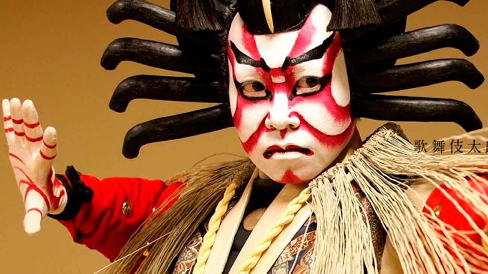

Kabuki is an art form rich in movement and sounds. It involves elaborately designed costumes, eye-catching make-up, outlandish1 wigs, and arguably most importantly, the exaggerated actions performed by the actors who are ONLY MEN. The highly-stylized movements serve to convey2 meaning to the audience; this is especially important since an old-fashioned form of Japanese is typically used, which is difficult even for Japanese people to fully understand.

Dynamic stage sets such as revolving platforms and trapdoors allow for the prompt changing of a scene or the appearance/disappearance of actors. Another specialty of the kabuki stage is a footbridge (hanamichi) that leads through the audience, allowing for a dramatic entrance or exit. Ambiance is aided3 with live music performed using traditional instruments. These elements combine to produce a visually stunning4 and captivating performance.

Plots are usually based on historical events, dramas, moral conflicts, love stories, tales of tragedy of conspiracy, or other well-known stories. A unique feature of a kabuki performance is that what is on show is often only part of an entire story (usually the best part). Therefore, to enhance the enjoyment derived, it would be good to read a little about the story before attending5 the show. At some theaters, it is possible to rent headsets6 which provide English narrations and explanations.
