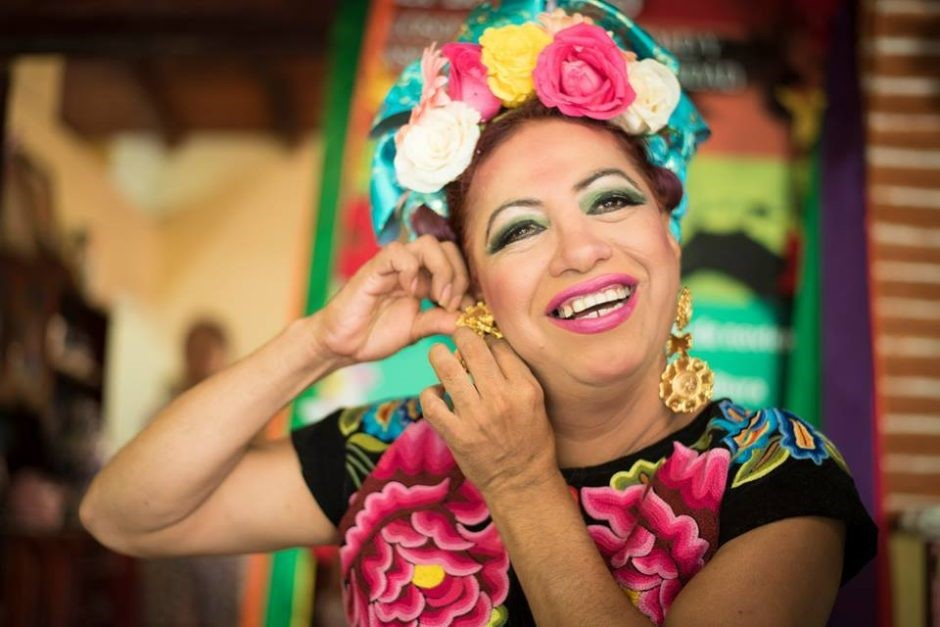

A Third Gender Embraced By The Zapotec People

_Muxe_ is a Zapotec word derived from the Spanish “mujer”, or woman; it is reserved males who, from boyhood, have felt themselves drawn to living as a woman, anticipating roles set out1 for them by the community.
Anthropologists trace the acceptance of people of mixed gender2 to pre-Colombian Mexico, pointing to accounts of cross-dressing3 Aztec priests and Mayan gods who were male and female at the same time. Spanish colonizers wiped out most of those attitudes in the 1500s by forcing conversion to Catholicism. But mixed-gender identities managed to survive in the area around Juchitán, a place so traditional that many people speak ancient4 Zapotec instead of Spanish.

Not all muxes express their identities the same way. Some dress as women and take hormones to change their bodies. Others favor male clothes. What they share is that the community accepts them; many in it believe that muxes have special intellectual and artistic gifts.

Since the 1970s, the town holds a three-day festival known as Vela de las Intrepidas (Vigil of the Intrepids) to celebrate the muxes. Many crossdress for the event, as well as in their daily lives, as they walk the streets of what many have called a “haven” or “paradise” for gay men and transgender5 people. On the Isthmus of Tehuantepec, especially in Juchitán, every family considers it a blessing6 to have one gay son.
